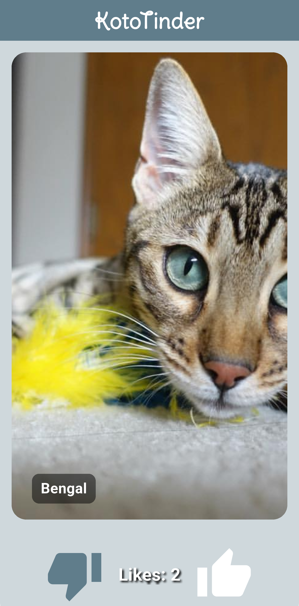
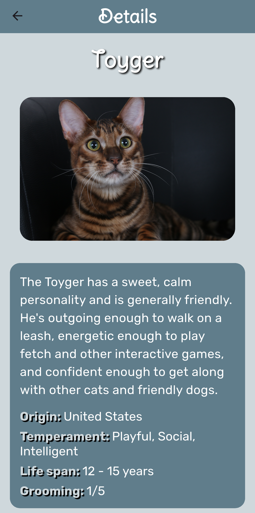
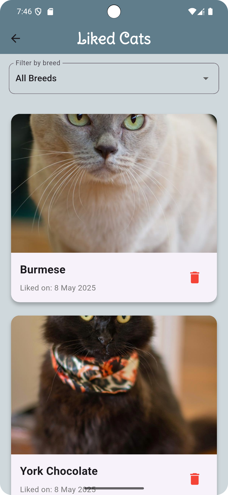

# KotoTinder

KotoTinder - приложение наподобие Tinder, в котором пользователи могут посмотреть фотографии кошек различных пород, а также лайкнуть понравившиеся породы.

## Features

1. На главном экране отображается рандомная порода кошки
2. Свайп влево пропускает кошку, в то время как свайп вправо лайкает понравившуюся породу
3. При нажатии на лайк (или свайпе вправо) увеличивается счетчик лайков
4. Нажатие на фото кошки приводит к отрытию экрана с детальным описанием породы этой кошки
5. Кэширование изображений, позволяющее загружать фотографии быстрее

## Screenshots

## Screenshots

|  |  |  |
|:---:|:---:|:---:|
| Главный экран | Главный экран | Экран с описанием породы |
