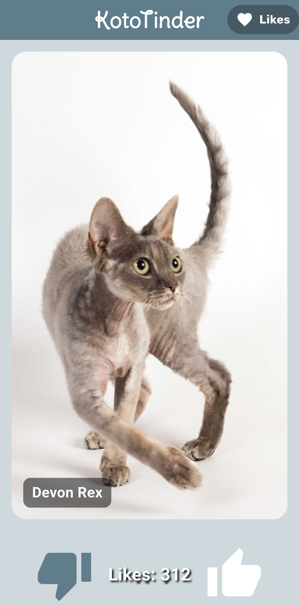
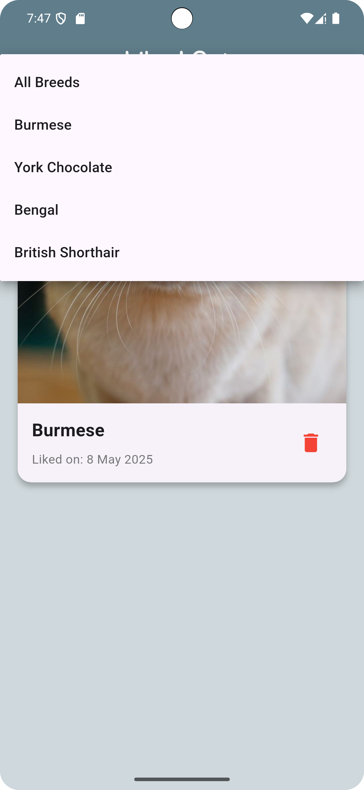

# KotoTinder

KotoTinder - приложение наподобие Tinder, в котором пользователи могут посмотреть фотографии кошек различных пород, а также лайкнуть понравившиеся породы.

## Features

1. На главном экране отображается рандомная порода кошки
2. Свайп влево пропускает кошку, в то время как свайп вправо лайкает понравившуюся породу
3. При нажатии на лайк (или свайпе вправо) увеличивается счетчик лайков
4. Лайки сохраняются при выходе из приложения
5. Нажатие на фото кошки приводит к отрытию экрана с детальным описанием породы этой кошки
6. Кэширование изображений, позволяющее загружать фотографии быстрее
7. Экран понравившихся котиков со скроллящимся списком всех лайкнутых котиков
8. Экран понравившихся котиков содержит фотографию кошки, название породы, дату лайка, а также кнопку удаления котика из этого списка
9. При нажатии на кошку на экране лайкнутых котиков открывается описание породы
10. Фильтрация по породе на экране лайкнутых котиков в виде выпадающего списка пород
11. При выборе породы в фильтре список обновляется мгновенно
12. При отсутствии сети появляется неблокирующий SnackBar, сообщающий об ошибке сети
13. Есть возможность посмотреть ранее лайкнутых котиков при отсутствии сети

## Screenshots

|  |  |
|:---:|:---:|
| Главный экран | Экран с описанием породы |

|  |  |
|:---:|:---:|
| Экран лайкнутых котиков | Фильтрация по породе |

|  |  |
|:---:|:---:|
| Ошибка сети во время использования приложения | Ошибка сети при загрузке приложения |

|  |
|:---:|
| Попытка лайкнуть во время режима оффлайн |

## Download

[.apk file](https://github.com/Alsmrnv/KotoTinder/releases/tag/v.2.0.0)
